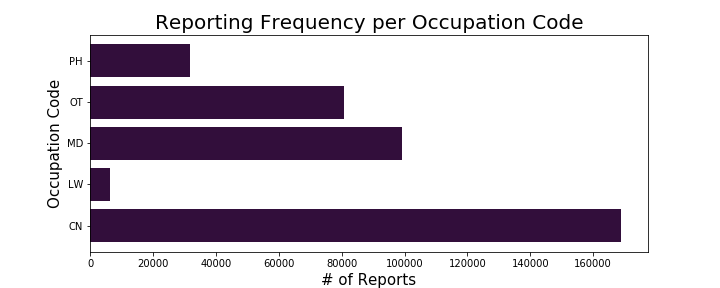
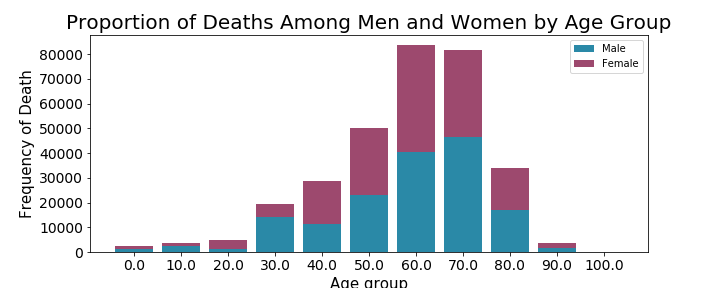
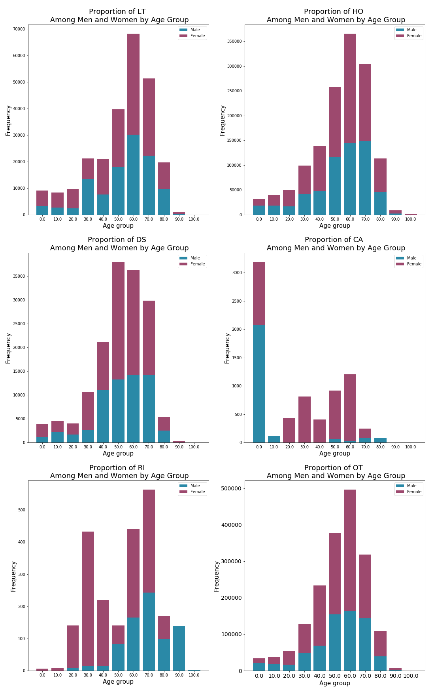

# Adverse Drug Events: Identifying trends in adverse drug events to help tailor medications for patients


###### Image by Benjamin Miller(2)

### Description: 

The purpose of this capstone project is to use patient attributes such as age, weight, and gender to help predict the likelihood a patient will experience a side effect from a given drug. 

### Data Used:

The U.S. Food and Drug Administration (FDA) Adverse Event Reporting System (FAERS). FAERS is a database that is a collection of reported medication adverse events, medication errors, and product quality complaints. The database supports the post-marketing surveillance of drugs ('phase IV' trial). (1) For this capstone, 2018 Quarter 4 FAERS data was used. 

### Data Overview:

* 7 tables with case ID as common element to each: 
  * **Demographics**
    * 394,066 rows, 34 columns
  * **Drug information**
    * 1,546,835 rows, 22 columns
  * **Drug reaction**
    * 1,250,978 rows, 4 columns
  * **Outcomes**
    * 299,135 rows, 3 columns
  * Source of report
    * 21,075 rows, 3 columns
  * Treatment dates
    * 620,308 rows, 9 columns
  * indications
    * 1,064,664 rows, 4 columns

Additional information on this dataset may be found [here](https://pharmahub.org/app/site/resources/2018/01/00739/FDA-FAERS-Data-Dictionary.pdf)

### Minimum Viable Product (MVP) Objectives:

* MVP: Determine most commonly reported adverse event for a medication within each age group to determine probability of experiencing commonly reported adverse event.
* MVP+: MVP and determine the probability of experiencing commonly reported adverse event for a medication given patient's age and sex
* MVP++: MVP+ and determine if other patient attributes such as weight plays a potential role in experiencing side effects given a medication.

### Raw Data:

Data was loaded into pandas dataframes with columns of interest selected. This was done to conserve memory and runtime due to the large nature of these tables. I knew which columns I wanted to select by using `.head()`, `.describe()`, `.info()`, and `.columns` in addition to using [this data dictionary](https://pharmahub.org/app/site/resources/2018/01/00739/FDA-FAERS-Data-Dictionary.pdf). Of the 7 tables listed above, pertinent columns came from 4 tables (Demographics, Drug information, Drug reaction, and Outcomes), all 4 of which were merged into a single pandas dataframe. Due to the this database collecting reports from users, there were inconsistencies in the data collected primarily in the form of inconsistent measurement units. Take for example the following that came from the demographics table:

| **age**  | **age_cod** |
| ------------- | ------------- |
| 1.0  | DY  |
| 58.0  | YR  |
|60.0 | YR |

In the example above, the age column displayed the numeric value of a patient's age and in the age_cod column you can see DY (Day) and YR (Year). In order to get these units all on the same page the following function was used:

```
def code_to_numeric(code):
    '''
    Converts age units to age in years
    '''
    if code == 'DY':
        return 1/365
    if code == 'YR':
        return 1
    if code == np.nan:
        return 0
    if code == 'MON':
        return 1/12
    if code == 'DEC':
        return 10
    if code == 'WK':
        return 7/365
    if code == 'HR':
        return 1/8760
        
 merged_df['age_multiplier'] = merged_df['age_cod'].map(code_to_numeric)
 ```
 A similar issue was encountered with weight and unit conversion:
 
 ```
 def weight_conversion(code):
    '''
    converts weight units to weight in lbs
    '''
    if code == 'KG':
        return 2.20462
    if code == np.nan:
        return 0
    if code == 'LBS':
        return 1
 ```
 
 
### Exploratory Data Analysis (EDA):
During exploration of this dataset, I explored patient attributes of potential interest such as sex, weight, and age. The distributions of age and weight are as follows:


The distribution of patient age in years appears to be left-skewed and the distribution of patient weight in lbs appears to be right-skewed. The average age of the patients in this dataset was 58 years with median at 62 years. The average weight of patients in this dataset came out to 166 lbs and median of 158 lbs. I also explored the relationship of weight and age of the patients in this dataset as compared among men and women:


The results of this comparison shows that the weight tends to drop off slightly after the average age and that in general it appears that men have higher weights than women. Nothing unexpected or surprising from these findings. To dig into the dataset, I wanted to explore 2 columns, 'outc_cod' (outcome codes) and 'occp_cod' (occupation code). The outcomes code column had the following possible values:

CA = congenital anomaly

DE = death

DS = disability

HO = Hospitalization - initial or prolonged

LT = life-threatening

OT = other serious (important medical event)

RI = required intervention to prevent permanent impairment/damage

The occupation code column (or what you can think of as the role of the reporter) had the following possible values:

MD = Physician

PH = Pharmacist

OT = Other health-professional

LW = Lawyer

CN = Consumer

Due to this dataset coming from a database of reports relating to adverse events to medications, I was interested in identifying the frequency of each of these outcomes occurring in addition to looking at who was primarily reporting these adverse events:




I was able to conclude from this exploratory analysis that the highest volume of adverse reactions had an outcome classified as other serious (important medical event) and that the highest volume of reports were coming directly from consumers. I decided to do hypothesis testing based on my findings related to outcomes, specifically the outcome of death. 

### Hypothesis Testing:
* Hypothesis Test # 1:

   H0: There is no relationship between proportion of deaths related to adverse drug events among men and women.
   
   Ha: There is a relationship between proportion of deaths related to adverse drug events between men and women.
   
   Statistical Test Used: Chi-Squared Test for Independence; alpha=0.05
   
   Results:
   
| **Result** | **Value** |
| -------- | ------- |
| chi2 | 9128.3 |
| p-value | 0.0000* |
| dof | 10 |

  *The p-value was rounded to 0.00 by ```stats.chi2_contingency()``` indicating that this p-value was very small to begin with.

  
  
  Although death was the primary outcome that was of interest to me, I looked further into the relative proportions of outcome occurences among men and women. 
  
  
  What immediately stands out to me are the disproportionalities among several age groups in the outcome category for 'RI' or 'Required intervention to prevent       permanant impairment/damage' category. As a pharmacist, the questions that naturally came to mind was 'what are the drugs responsible?', 'Are these drugs           primarily used by women such as birth control?' and 'What was the top reported adverse event that caused the required intervention?'. My inquiries lead to the     following top 5 drugs reported with the outcome of 'RI':
  
| **Drug Name**  | **Report Frequency** | **Top Reported Adverse Event**  |
| ------------- | ------------- | -------------|
| Mirena  | 116  | Complication associated with device |
| Paraguard T 380A  | 61 | Headace; Pregnancy with contraceptive device |
| Nexplanon | 61 | Anxiety |
| Lisinopril  | 61  | Angioedema  |
| Warfarin  |  57  | Anemia |

  
  
### Interesting Finds:
* The top reported drug in this database is Xolair (omalizumab)
 * This medication is indicated for moderate to severe asthma and chronic idiopathic urticaria (3)
 * The top 5 reported adverse events related to Xolair in my dataset with their counts are as follows:
   
| **Adverse Event**  | **Frequency** |
| ------------- | ------------- |
| Decreased Weight  | 2579  |
| Dysnea  | 2348  |
|asthma | 2333 |
| Nasopharyngitis  | 2312   |
| Cough    |  2160  |

* When the data was grouped by age groups and sex I was able to identify the top reported medication for each of these groups:


Not surprisingly, Xolair (the top reported drug in the entire dataset) appeared frequently throughout the different age/sex groups. This data can lend providers an idea of which medications to monitor more carefully or more frequently in patients of certain age/sex.

### Conclusions:
* Men and women are not equal when it comes to the proportion of certain outcomes related to medications, likewise with certain age groups. Information like this can lend itself to knowing which medications should either be avoided for particular patients or monitored more carefully/frequently. 

### Further study:
* Linear regressions to predict likelihood of outcomes given handful of patient attributes such as age, sex, weight, and medication they are taking. This will be a potential direction for capstone 2. 

### References:

(1) https://www.fda.gov/drugs/surveillance/questions-and-answers-fdas-adverse-event-reporting-system-faers

(2) http://www.freestockphotos.biz/stockphoto/1167

(3) https://www.accessdata.fda.gov/drugsatfda_docs/label/2016/103976s5225lbl.pdf
